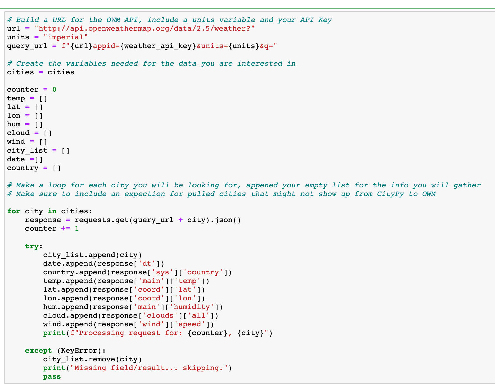
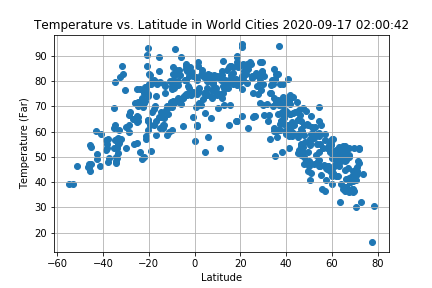
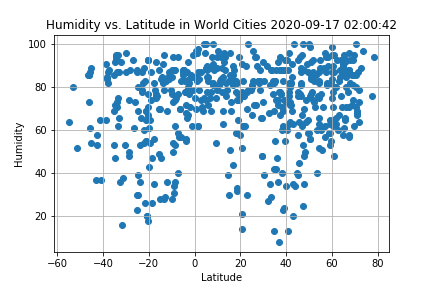
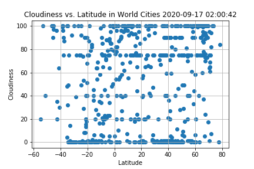
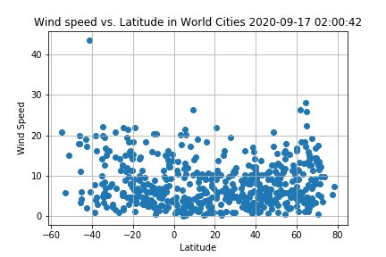
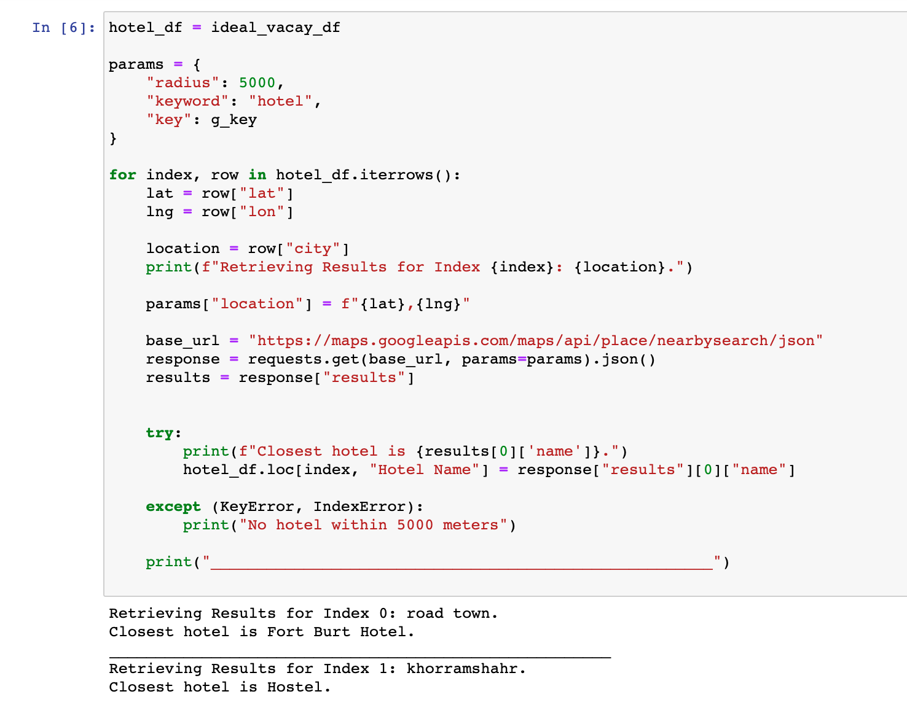
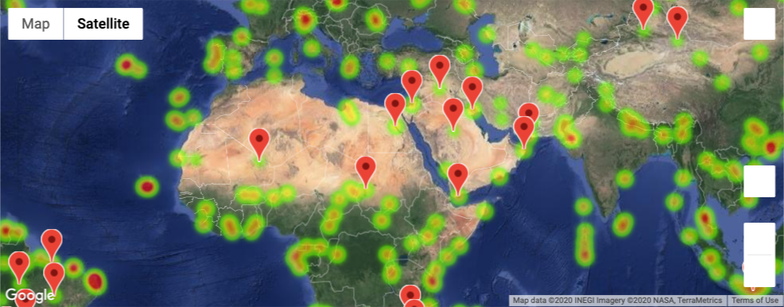

# API Challenge - World Weather Analysis 

## Summary: 
This challenge focused on using API calls to generate weather data for multiple locations all over the world. The main goal was to see: "What's the weather like as we approach the equator?" The next task was to create the perfect vacation based on ones weather preferance and use the Google Places API to search for the nearest hotel. 

## Skills Displayed: 
* Getting API requests 
* Converting JSON into python dictionaries 
* Generation of plots using Matplotlib in Jupyter Notebook
* Using Google Maps and Places API to obtain information about geographic areas

## Part 1: WeatherPy 
Our task was to create a Python script to visualize the weather of 500+ cities across the world of varying distance from the equator. To accomplish this, we utilized a simple Python library, the OpenWeatherMap API, and a little common sense to create a representative model of weather across world cities.
[Jupyter Notebook](https://nbviewer.jupyter.org/github/kasiakalemba/API-Weather-Analysis/blob/master/WeatherPy/WeatherPy.ipynb)

First requirement was to create a series of scatter plots to showcase the following relationships:
* Temperature (F) vs. Latitude

* Humidity (%) vs. Latitude

* Cloudiness (%) vs. Latitude

* Wind Speed (mph) vs. Latitude

Second requirement was to run linear regression on each relationship: 
* Northern Hemisphere and Southern Hemisphere 
* Then creating a multiple linear regression plots. 

## Part 2: VacationPy 
The task here was to create a heat map that displays the humidity for every city from part I. Using those cities, the task was to narrow them down to your favorite weather conditions and choose your ideal vacation spot. Then based on that location, using Google places API, I found the closest hotel to that city. 
[Jupyter Notebook](https://github.com/kasiakalemba/API-Weather-Analysis/blob/master/VacationPy/VacationPy.ipynb)

