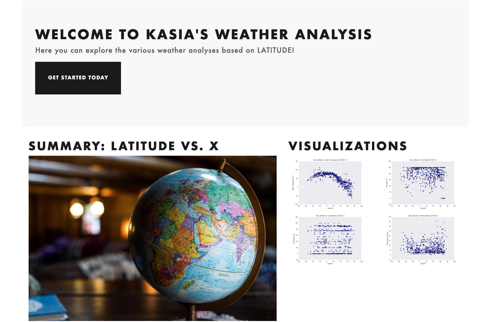
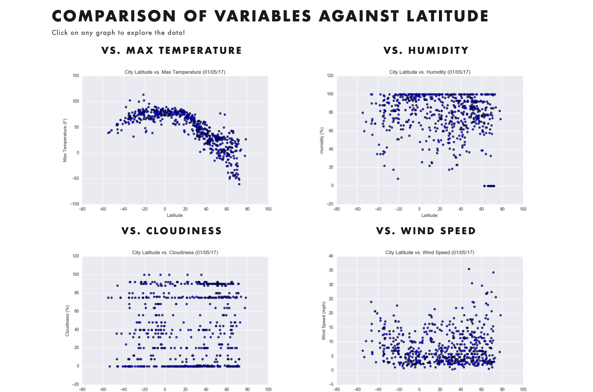

# World Weather Analysis & Visualization
 
## Summary
This project uses API calls to generate weather data for multiple locations all over the world. The goal is to see how the weather changes as we approach the equator. Then, using the generated graphs I built a simple webpages displaying a weather analysis based on latitude. 

[Visit the Weather Analysis Page](https://kasiakalemba.github.io/Weather-Analysis/)

## Technologies
* Language: Python - version 3.7
* Web design: HTML, CSS, Boostrap 
* Data Extraction & Exploration: Jupyter notebook, Pandas, Numpy
* Requests
* Citypy 
* Google maps & Places

## Weather Analysis
I visualized the weather of 500+ cities across the world of varying distance from the equator. To accomplish this, I utilized a simple Python library, the OpenWeatherMap API to create a representative model of weather across world cities. 
[Jupyter Notebook](https://nbviewer.jupyter.org/github/kasiakalemba/API-Weather-Analysis/blob/master/WeatherPy/WeatherPy.ipynb)

 
First I created a series of scatter plots to showcase the following relationships:
* Temperature (F) vs. Latitude

 

As expected, the weather becomes warmer as one approaches the equator. We can see a clear correlation between the temperature values as you get closer to value 0 which is the equator. The temperatures gradually fall as the latitude increases.

* Humidity (%) vs. Latitude

 

Humidity and latitude do not see to have a clear correlation. However, for negative latitude coordinates, there seems to be less high humidity recordings compared higher values. The represented cities average around 80% humidity.

* Cloudiness (%) vs. Latitude

 

Cloudiness and latitude do not display a clear correaltion. The pattern seems random although latitudes above 0, do cluster more higher values compared to negative latitude values.

* Wind Speed (mph) vs. Latitude

 

Windspeed and latitude also display no clear correlation. We do speed higher wind values cluster more in the positive latitude values. We can also notice that the highest windspeeds were recorded in citites with the highest latitude values as well.

Second I ran linear regression on each relationship: 
* Northern Hemisphere and Southern Hemisphere 
* Then creating a multiple linear regression plots. 

## Destination Selection
I created a heat map that displays the humidity for every city from part I. Using those cities, I narrowed them down to my favorite weather conditions and choose an ideal vacation spot. Then based on that location, using Google places API, I found the closest hotel to that city. 
[Jupyter Notebook](https://github.com/kasiakalemba/API-Weather-Analysis/blob/master/VacationPy/VacationPy.ipynb)

## Webpage: Latitude Analysis Dashboard
In building this dashboard, I created individual pages for each plot and a means to navigate between them. These pages contain the visualizations and their corresponding explanations. I built a landing page, where we can see a comparison of all of the plots, and another page where we can view the data used to build them.

